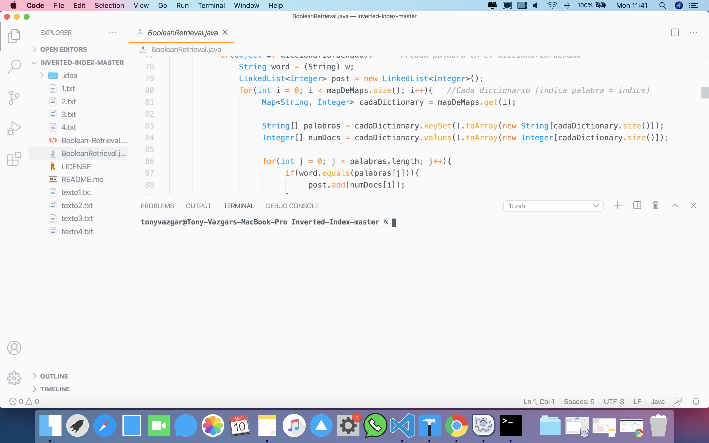

# My-VSCode-Config
My personal Visual Studio Code configurations and packages

<p align="center">
  
</p>

# Extensions

Install these extensions trough VScode or terminal:

```
  aeschli.vscode-css-formatter
  akamud.vscode-theme-onelight
  Buttars.colorful
  file-icons.file-icons
  Hyzeta.vscode-theme-github-light
  ms-python.python
  pascalpixel.cameo
  PKief.material-icon-theme
  teabyii.ayu
  wayou.vscode-icons-mac
  zhuangtongfa.material-theme
```

# Settings file

Edit your settings.json depending on your platform, the user settings file is located here:

* Windows ``` %APPDATA%\Code\User\settings.json ```
* Mac ``` $HOME/Library/Application Support/Code/User/settings.json ```
* Linux ``` $HOME/.config/Code/User/settings.json ```

```json
{
    "workbench.colorTheme": "Ayu Light",
    "window.zoomLevel": 1,
    "python.defaultInterpreterPath": "/usr/bin/python3",
    "workbench.iconTheme": "vscode-icons-mac",
    "editor.fontSize": 13,
    "editor.cursorBlinking": "expand",
    "editor.fontWeight": "200",
    "editor.minimap.side": "left",
    "terminal.integrated.fontWeight": "bold"
}
```
